# Dublin Airport Plane Spotters
(Developer Alper Kanburoglu)

[link to live page](https://8000-plum-woodpecker-opuoy299.ws-eu11.gitpod.io/index.html)

# Contents

1. [User Experience](#1-user-experience)
   1. [Target User](#i-target-user)
   2. [User Stories](#ii-user-stories)
   3. [User Requirment](#iii-user-requirment)
2. [Aims](#2-aims)
   1. [User Aims](#i-user-aims)
   2. [Site Creater Aims](#ii-site-creater-aims)
3. [UX](#3-UX)
   1. [Structure](#i-structure)
   2. [Design and Colour](#ii-design-and-colour)
   3. [Font](#iii-font)
   4. [Wireframes](#iv-wireframes)
4. [Features](#3-Features)
   1. [Navigation Bar](#i-navigation-bar)
   2. [The Landing Page](#ii-the-landing-page)
   3. [Community Information](#iii-community-information)
   4. [Special Flights Section and Locations](#iv-special-flights-section-and-locations)
   5. [Survey Page](#v-survey-page)
   6. [Images](#vi-images)
   7. [video](#vii-video)
   8. [Footer](#viii-the-footer)
   9. [404 Page](#ix-404-page)
   10. [Thank You Page](#x-thank-you-page)
   11. [Features Left To Implement](#xi-features-left-to-implement)
5. [Technologies Used](#5-technologies-used)
   1. [Code Used](#i-code-used)
   2. [Tools and Framework](#ii-tools-and-framework)
6. [Testing](#6-testing)
   1. [HTML Validation](#i-html-validation)
   2. [CSS Validation](#ii-css-validation)
   3. [Accessibility](#iii-accessibility
9. [Deployment](https://github.com/alperkan1/Dublin-Airport-Plane-spotters#deployment)
10. [Credits](https://github.com/alperkan1/Dublin-Airport-Plane-spotters#credits)
11. [Content](https://github.com/alperkan1/Dublin-Airport-Plane-spotters#content)
12. [Media](https://github.com/alperkan1/Dublin-Airport-Plane-spotters#media)

## 1. User Experience

### i. Target User

- Plane spotters to meet and share their experiences.
- A site for people to share their aeronautical images with the potenial of selling them.
- Plane spotters looking to get the most up to date flight information.
- Helping plane spotters to locate the best spotting locations.
- People interested in unique and exclusive experiences at Dublin Airport.

### ii. User Stories

#### First Time User 

- As a first time user, I want to be able to be a part of a Plane Spotting comunity at Dublin Airport.
- As a first time user, I want to be able to see other users photos.
- As a first time user, I want to be able to locate the best locations for plane spotting at Dublin Airport.
- As a first time user, I want to get the most up to date flight information.
- As a first time user, I want to find the social media links for the the comunity.
- As a first time user, I want to be able to give my feed back.
- As a first time user, I want to be able to contact the society.

#### Returning User

- As a returing user, I want to be able to get the updated schedules for flights arriving and departing from Dublin Airport.
- As a returing user, I want to be able to see new images from existing and new members.
- As a returing user, I want to be able to share images.
- As a returing user, I want to have the oportunaty to get unique experiences.
- As a returing user, I want new locations for spotting aircraft.

#### Site Owner 

- As a site owner, I want users to get updated images.
- As a site owner, I want users to share their images and experiences with us.
- As a site owner, I want users to be able to give their feedback.
- As a site owner, I want users to be able to navigate the site easily.
- As a site owner, I want to be able to contact users with news letters.

### iii. User Requirment

- An easy to use Navigation toolbar.
- Accessible to those with visual and hearing imparements.
- Easy to navigate and located required information.
- Responsive to all devices sizes.
- Visually pleasing design and layout.
- Concise and informtive content.
- Up to date content.

## 2. Aims

### i. User Aims

- Finding a community if like-minded of plane spotters in Dublin.
- To share images of aircraft at Dublin Airport.
- To get up to date information.
- To find the best plane spotting locations.
- To give my feedback.

### ii. Site Creater Aims

- To connect like minded users.
- To create a data base of contact information and feedback.
- To create a data base of images that may be shared or sold.
- To find new locations.
- To share one-off experiences with others.

## 3. UX

### i. Structure 

The site is structured in a visually appealing manner which draws the eye down the page. The site implements a user freindly navigtion bar. On all pages the company logo is situated on the top left and when clicked will bring you back to the home page. The navigation bar is loacated on the top right with 3 links. On all pages the footer has links to the social pages and contact details.

#### Home Page 

On the home page you can see an image of an airplane landing at Dublin Airport. Secton 2, where you can find an image of an aircraft in a circle with information about the community. At the bottom of the page the live landing and take off times are visable with a map of the best spotting locations. This page is responsive as the scale of the page changes to smaller devices.

#### Gallery Page 

The gallery page has 9 images in boxes with with 3 columns. The images become inline blocks as the scale of the display gets smaller.

#### Survey Page

The survey page has a large image of an aircraft that zooms in. This page has a visually pleasing font with selectable options.

#### Thank You Page 

This page is entered after the survey is completed. This has a large image with a text box to inform the user that the survey has been sucessful. 

#### 404 Page 

This has a large image with a box overlay informing the user that they are on the wrong page and should go back.

### ii. Design and Colour

The site was desinged with background colours that compliment and enhances the images used. The colours are bright, cool tones to reflect the clear sky often captured in spotter images. The design of the site was choosen to instil the emotion of plane spotting on your device, anywhere in the world.  

### iii. Font

Oswald with a back up of sans serif was used on the logo which represents the clear lines of an aircraft. H1 uses the playfair with a backup of san serif. h2 uses the oswald with san serif backup and the body uses the Roboto with sans serif backup. The fonts were chosen with user accessebility in mind. All of the fonts are considered to be dyslexia freindly and are clearly defined for people with visual impairments. 

### iv. Wireframes

Home Page

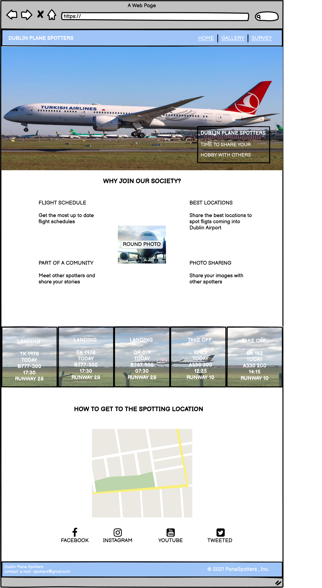

   

Gallery

         

Survey

   

## 4. Features

### i. Navigation Bar
- The links to jump from page to page for comfortable navigation on all devices.
- The links will be placed on all 5 pages.
- The person viewing the page will be able to navigate without having to use the the history or the back button to navigate.

Navigation Bar

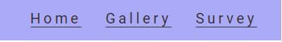

   

### ii. The Landing Page 
- the landing page will have a photo of Dublin Airport. With Text overlay of Dublin Airport Plane Spotters.
- This section is to communicate what the site is for with an inspirational image of an aircraft in Dublin Airport. 

The Landing Page

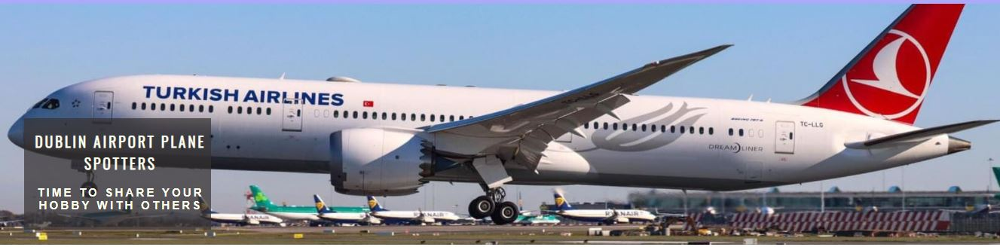

 

### iii. Community Information
- This section will include why the person should join the site what benefits they will receive from joining the site.
- The user will become a part of a community of likeminded people.
- The site should encourage people to go plane spotting together. And be a part of a larger group.
- What the advantages will be visiting the site.

Community Information

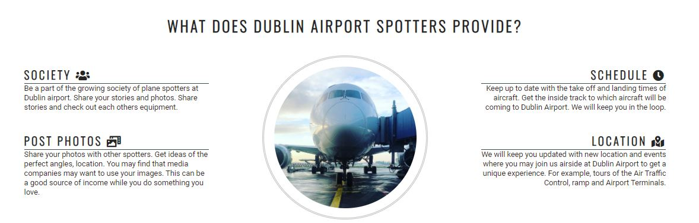

 

### iv. Special Flights and Locations
- This section will inform users of when certain aircraft will be landing at Dublin Airport.
- What time it is scheduled to land or take off.
- This section will be updated with new times and dates of unusal aircraft arriving in Dublin Airport.
- The loactions will inform the user of the best places to see the aircraft coming to land.
- The locations uses google maps.

Special Flights and Locations

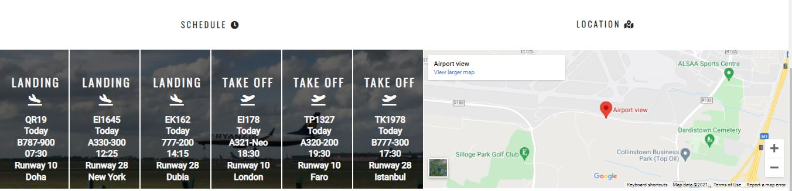

 

### v. Survey
- We will be asking people about their Spotting Experiences and get their feedback.
- The member will supply us with their name, surname and e mail adress. 
- We will be able to collect infromations for our database.

Survey

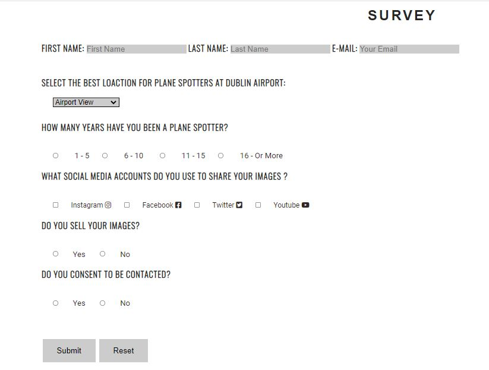

  

### vi Images
- Will show images of aircraft in Dublin Airport by the community.
- This section is valuable to the user as they can see what type of photos people like to take.
- Where the best images can be taken.
- Any one interested in purcashing images will be able to see them here.

Images

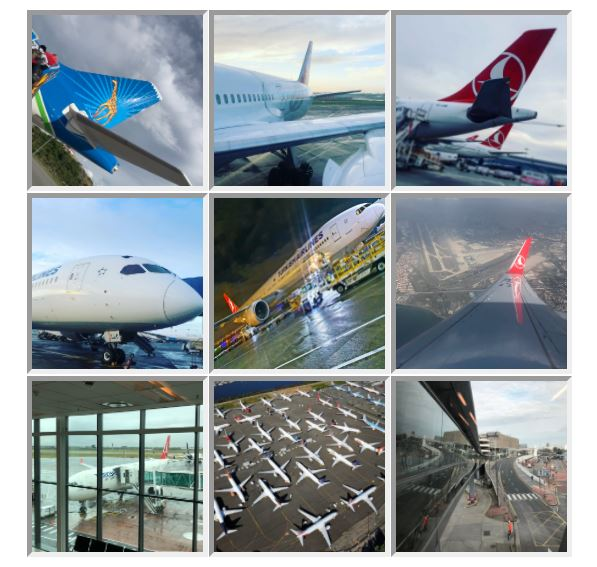

  

### vii. Video
- The video is of dublin airport by the spotting comunity.

Video

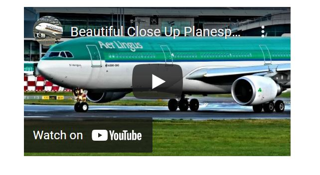

  

### viii. The Footer
- Will have social media links that relate to the Dublin Airport Plane Spotting community.
- This has the contact and company detials.
- this will be on all pages

Footer

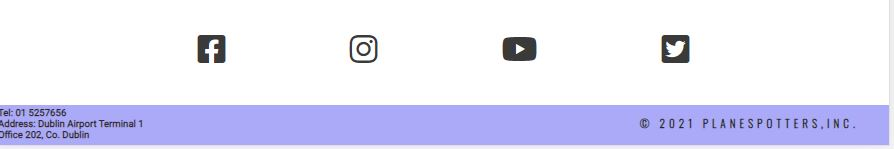

  

### ix. 404 Page

- If a link does not wrk you will end on this page.

Footer

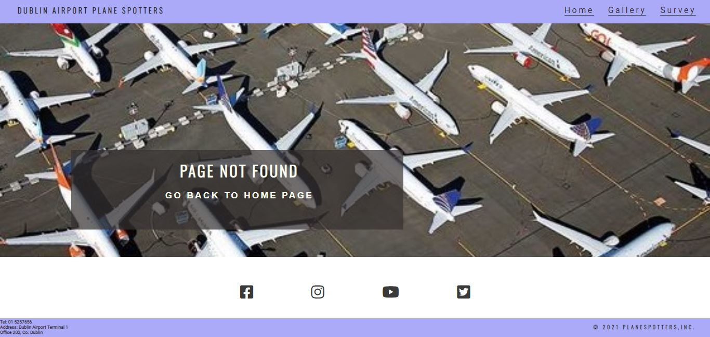

 

### x. Thank You Page

- After you submit your survey it will take you to this page.
- The page is to inform the user that the link has worked.

Footer

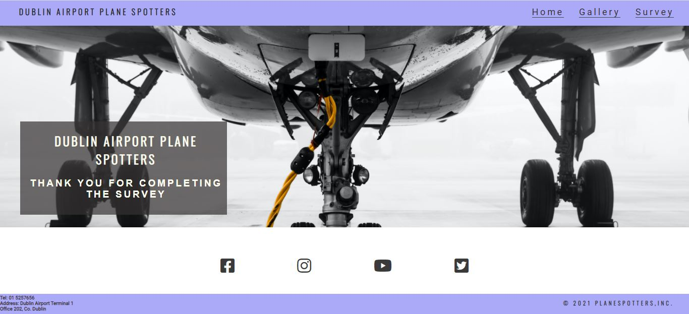

 

### xi. Features Left To Implement
- A community chat where people from the group can live chat and share their images.
- Mail alert service when a special aircraft is arriving to the airport for the community get alerts.
- An image sales page where people can sell there images.

## 5. Technologies Used

### i. Code Used

- CSS
- HTML

### ii. Tools and Framework

- Git 
- Gitpod 
- Github
- Balsamiq
- Google Fonts
- Font Awsome
- Google Fonts

## 6. Testing

### i. HTML Validation

The W3C Markup Validation Service used to validate the HTML code. On page gallery and survey warning for sections not having a heading. For desing reasons that was chosen.

Home

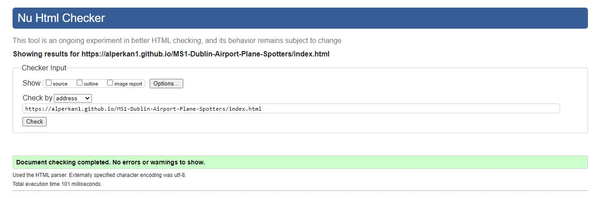

 

Gallery

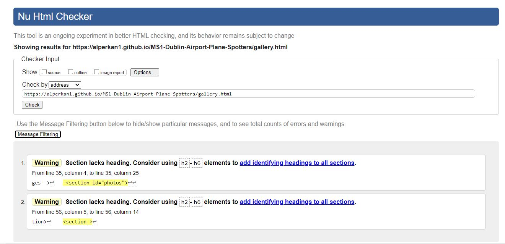

 

Survey

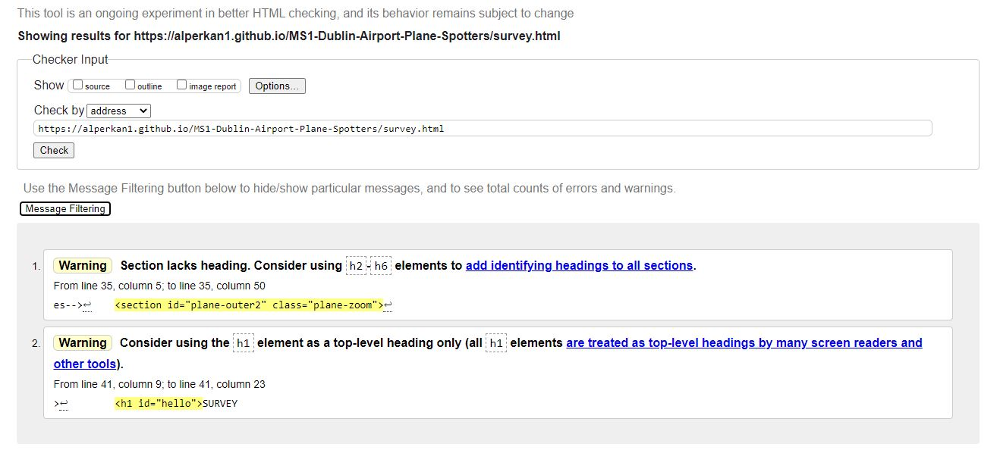

 

Thank You

 

404

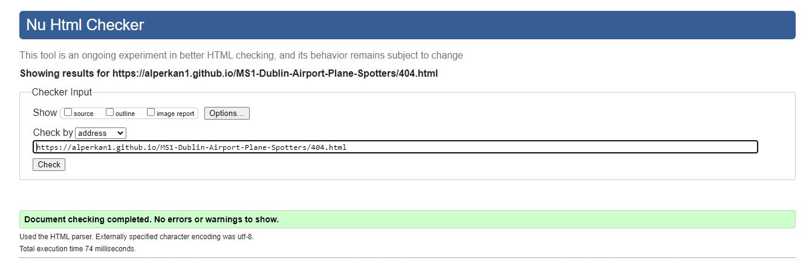

### ii. CSS Validation

W3C jigsaw Validation was used to test the code with a direct input. 1 warning and no errors are showing.

CSS Validation

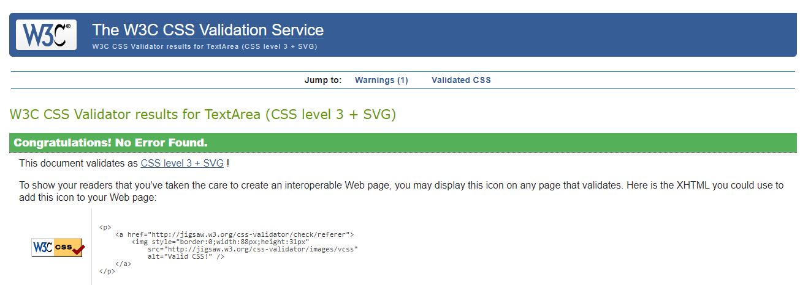

### iii. Accessibility

The WAVE WebAIM acessibility tool was used to confirm check that the site is up to standart with 0 errors.

Home

 

Gallery

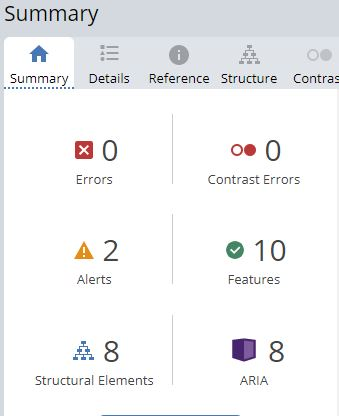

 

Survey

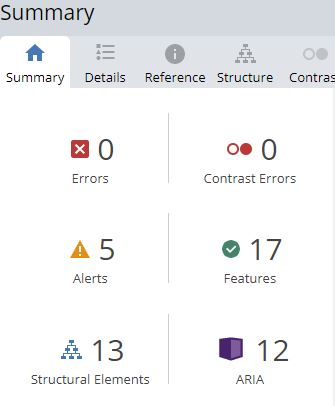

 

Thank You

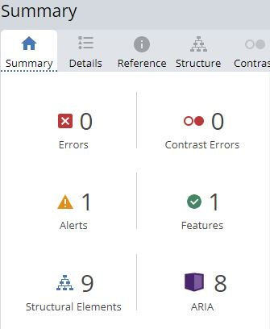

 

404

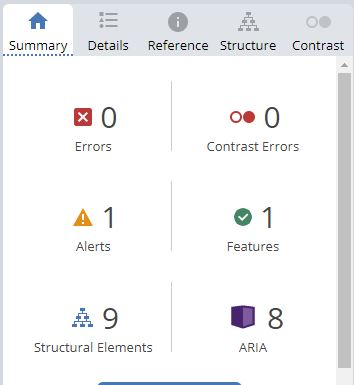

### iv. Speed test

### v. Testing on Devices

### Unfixed Bugs
- Have to build it to test it

## Deployment
-Have to buid it to go truth the deployment steps

## Credits
-have to buid it first

## Content
-have to build it first
 
## Media

-have to build it first

[Back to the top](https://github.com/alperkan1/Dublin-Airport-Plane-spotters#Dublin-Airport-Plane-Spotters)

